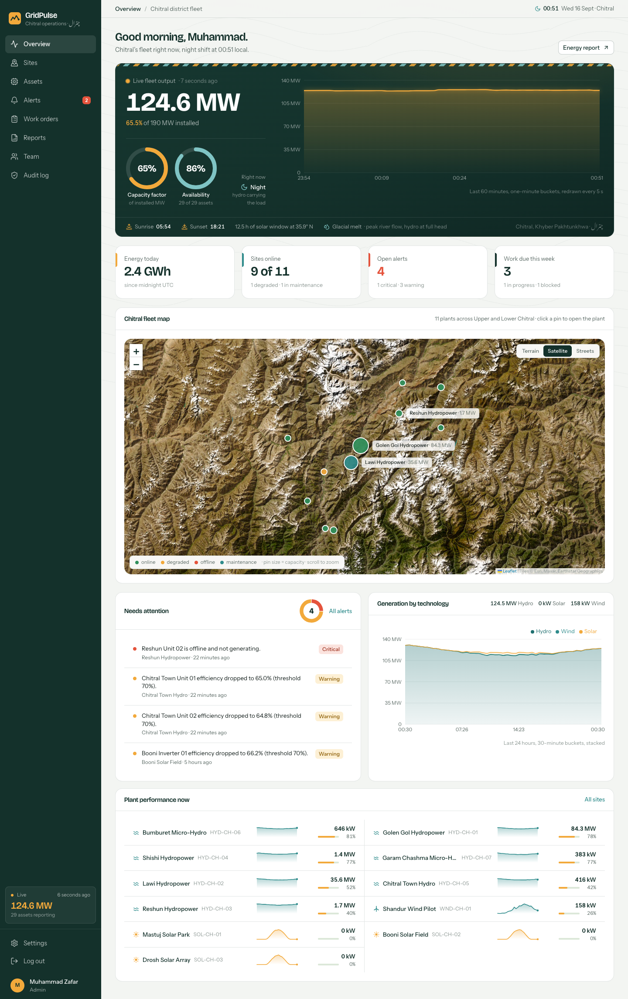

# GridPulse — Chitral renewable operations platform

GridPulse is a control-room web application for the hydro, solar and wind plants of Chitral district,
Khyber Pakhtunkhwa. It shows live generation from every plant, raises alerts when a unit crosses its
thresholds, and turns each alert into a tracked work order for the field crew.

Built as the Week 8 capstone of my full-stack internship: **Laravel 12 REST API + React 18 SPA**.
New here? Read [ABOUT.md](ABOUT.md) for the plain-language story: the place, the problem, what the
product does and how it works.



## The problem in one paragraph

Chitral's power comes from plants scattered across a Hindu Kush district with winter road closures:
one 108 MW hydro plant, a new 69 MW plant, village micro-hydro schemes, solar fields in the high valleys.
Each keeps its own log; faults are reported by phone. Nobody can quickly answer *how much are we
producing, which unit is failing, and who is fixing it*. GridPulse answers all three on one screen and
turns every alert into tracked work.

## Features

- **Live fleet overview** — fleet output, capacity factor and availability rings, 60-minute live
  chart, 24-hour generation stacked by technology, Chitral map with status-coloured plant pins.
- **Sites and assets** — full CRUD with validation, search, filters, pagination, per-site summary,
  24 h / 3 d / 7 d generation and efficiency charts, asset health scores.
- **Alerts** — generated automatically by rule evaluation (low efficiency, high temperature, asset
  offline, zero output) with open → acknowledged → resolved lifecycle and one-click conversion to a
  work order.
- **Work orders** — Kanban board and table, priority and due dates, assignees, linked to the site,
  asset and alert they came from; finishing the work resolves the alert.
- **Reports** — energy by site, technology or day for any date range, CSV export.
- **Team and audit** — admin manages roles and deactivation; every sign-in and change is logged.
- **Telemetry simulator** — a Laravel scheduled command that plays the role of the field devices,
  producing physically plausible readings every 5 seconds (solar follows a daylight curve, wind
  follows a turbine power curve, hydro is steady base load).

## Stack

| Layer | Choice |
| --- | --- |
| API | Laravel 12, PHP 8.3+, Laravel Sanctum tokens, Form Requests, API Resources, PHPUnit |
| Database | SQLite for development and tests; MySQL 8 for production (all queries are driver-portable) |
| Client | React 18, TypeScript, Vite, React Router, TanStack Query, React Hook Form + Zod, Recharts, Leaflet, Tailwind CSS v4 |
| Ops | Docker Compose (MySQL + API + nginx client), GitHub Actions CI |

## How to run it (step by step)

### 0. What you need installed

| Tool | Version | Check | Install |
| --- | --- | --- | --- |
| PHP | 8.3 or newer | `php -v` | macOS: `brew install php` · Windows: [XAMPP](https://www.apachefriends.org/) or [Laravel Herd](https://herd.laravel.com/) · Ubuntu: `sudo apt install php8.3 php8.3-sqlite3 php8.3-mbstring php8.3-xml php8.3-intl php8.3-curl` |
| Composer | 2.x | `composer -V` | https://getcomposer.org/download/ |
| Node.js | 20 or newer | `node -v` | https://nodejs.org (LTS) |
| Git | any | `git -v` | https://git-scm.com |

No database server is needed for local use: the API uses a SQLite file. MySQL is only for production.

### 1. Get the code

```bash
git clone https://github.com/Hamdanali3/GridPulse.git
cd GridPulse
```

### 2. Start the API (terminal 1)

```bash
cd api
composer install                       # PHP dependencies
cp .env.example .env                   # local settings (SQLite, CORS for localhost:3000)
php artisan key:generate               # app encryption key
touch database/database.sqlite         # Windows PowerShell: New-Item database/database.sqlite
php artisan migrate:fresh --seed       # tables + Chitral demo fleet + 7 days of readings (~20 s)
php artisan serve                      # API on http://localhost:8000
```

Check it: open http://localhost:8000/api/v1/health — you should see `"status":"ok"`.

### 3. Start the telemetry simulator (terminal 2)

```bash
cd api
php artisan schedule:work              # writes a reading per unit every 5 s; first tick at the next minute
```

Alternative that starts immediately: `php artisan gridpulse:tick --loop`. Without this process the
dashboard still works but the numbers do not move.

### 4. Start the web app (terminal 3)

```bash
cd client
npm install
npm run dev                            # http://localhost:3000
```

The dev server proxies `/api` to `http://localhost:8000`, so no extra configuration is needed.

### 5. Sign in

Open http://localhost:3000 and use a demo account (or click the role buttons on the login page):

| Role | Email | Password | Can do |
| --- | --- | --- | --- |
| Admin | admin@gridpulse.io | Admin12345 | everything, manage team, delete, audit log |
| Engineer | engineer@gridpulse.io | Engineer12345 | create/edit sites, units, work orders; handle alerts |
| Viewer | viewer@gridpulse.io | Viewer12345 | read only |

### 6. Stop, reset, reseed

- Stop any process with `Ctrl+C`.
- Fresh demo data: `php artisan migrate:fresh --seed` (stop the scheduler first, or it may tick mid-seed).
- Clear old readings only: `php artisan gridpulse:prune --days=7`.

### Run with Docker instead (MySQL, production-style)

```bash
cp .env.docker.example .env            # then put a key in APP_KEY (cd api && php artisan key:generate --show)
docker compose up --build              # client http://localhost:3000 · API http://localhost:8000
```

The API container migrates, seeds the demo fleet on first boot, runs the scheduler and serves HTTP.

### Common problems

| Symptom | Fix |
| --- | --- |
| `Class "PDO" not found` / `could not find driver` | Enable `pdo_sqlite` in `php.ini` (Windows: uncomment `extension=pdo_sqlite`) |
| `Missing required environment variable` / `No application encryption key` | `cp .env.example .env && php artisan key:generate` inside `api` |
| Login says "Cannot reach the server" | API not running on port 8000, or you opened the client on a port other than 3000/5173 (add it to `CLIENT_ORIGIN` in `api/.env`) |
| Dashboard number does not move | The scheduler (terminal 2) is not running |
| `database is locked` in the log | Only when two schedulers run at once; stop the extra one |
| Port 3000 already in use | `npm run dev -- --port 3001`, then add `http://localhost:3001` to `CLIENT_ORIGIN` |
| Map tiles do not load | Needs internet access; tiles come from OpenStreetMap, OpenTopoMap and Esri |

## Tests

```bash
cd api && php artisan test      # 30 feature tests, 222 assertions
cd client && npm run lint && npm run build
```

## Project layout

```
api/                     Laravel API
  app/Enums              PHP enums for roles, statuses, severities
  app/Http/Controllers   one controller per resource
  app/Http/Requests      Form Request validation
  app/Http/Resources     JSON shapes returned to the client
  app/Services           TelemetrySimulator, EnergyService, AuditLogger
  app/Console/Commands   gridpulse:tick, gridpulse:prune
  database/migrations    schema (see docs/DATABASE_SCHEMA.md)
  database/seeders       DemoFleetSeeder (Chitral fleet)
  tests/Feature          PHPUnit suite
client/                  React SPA
  src/lib                api client, auth context, types, formatters
  src/components         UI primitives and charts
  src/pages              one file per screen
docs/                    PRD, database design, API contract, wireframes, image guide
```

## API

Base URL `/api/v1`. Full contract in [docs/API_ROUTES.md](docs/API_ROUTES.md). Every response uses one
envelope: `{ success, data, meta? }` or `{ success: false, error: { code, message, details? } }`.

## Roles

| | Viewer | Engineer | Admin |
| --- | --- | --- | --- |
| Read everything | ✓ | ✓ | ✓ |
| Create / edit sites, assets, work orders | | ✓ | ✓ |
| Acknowledge / resolve alerts | | ✓ | ✓ |
| Delete records | | | ✓ |
| Manage team, view audit log | | | ✓ |

Enforced server-side by the `role:` middleware on every write route; the client only hides controls.

## Deployment

GridPulse is two deployables. Vercel hosts the **web app** (static Vite build). The **Laravel API** needs a
PHP host with a database and a running scheduler, so it goes to Railway, Render, Fly.io or any Docker host
(`api/Dockerfile`). Vercel cannot run the API.

### Deploy the web app to Vercel

1. Vercel → **Add New… → Project** → import `Hamdanali3/GridPulse`.
2. Leave **Root Directory** as `/` (the root `vercel.json` builds `client/` for you), **or** set it to `client`.
   Both work. Do not point it at `api`.
3. **Environment Variables** → add `VITE_API_URL` = the public origin of your API, no trailing slash,
   for example `https://gridpulse-api.up.railway.app`. Vite bakes this in at build time, so add it
   **before** the first deploy (or redeploy after adding it).
4. Deploy. Client routes such as `/sites/3` fall back to `index.html` through the rewrite in `vercel.json`.

If you skip step 3 the site loads but sign-in fails with
"API origin is not configured. Set VITE_API_URL on the hosting platform and redeploy."

### Deploy the API (Railway example)

1. New project → Deploy from GitHub → **Root Directory `api`** → add the MySQL plugin.
2. Variables: `APP_KEY` (from `php artisan key:generate --show`), `APP_ENV=production`, `APP_DEBUG=false`,
   `APP_URL=https://<api-domain>`, `DB_CONNECTION=mysql` + the five `DB_*` values from the plugin,
   `CACHE_STORE=database`, `SESSION_DRIVER=database`, `QUEUE_CONNECTION=database`,
   `CLIENT_ORIGIN=https://<your-vercel-domain>.vercel.app` (comma-separate several origins).
3. Start command:
   `php artisan migrate --force && php artisan config:cache && php artisan serve --host=0.0.0.0 --port=$PORT`
4. Add a second service from the same repo with start command `php artisan schedule:work`
   (the telemetry simulator). Run `php artisan db:seed --force` once from the shell for the demo fleet.
5. Check `https://<api-domain>/api/v1/health` returns `{"status":"ok","db":"connected"}`.

### Vercel troubleshooting

| Symptom | Cause | Fix |
| --- | --- | --- |
| `404: NOT_FOUND` on the deployed URL | Project imported at repo root before the root `vercel.json` existed, so nothing was built | Pull latest `main` and redeploy, or set Root Directory to `client` |
| "No Output Directory named 'dist' found" | Root Directory set to `/` with an old build config | Same as above |
| Build fails on `tsc -b` | Node < 20 | Project Settings → Node.js Version → 20.x or 22.x |
| Sign-in says "API origin is not configured" | `VITE_API_URL` missing at build time | Add the variable, then **Redeploy** |
| Sign-in says "Cannot reach the server" or CORS error in console | API down, or `CLIENT_ORIGIN` on the API does not include the Vercel domain | Fix `CLIENT_ORIGIN`, restart the API |
| Refreshing `/sites/3` gives 404 | Missing rewrite | Make sure `vercel.json` is deployed |

Full detail, Docker and production checklist: [../day39/DEPLOYMENT_GUIDE.md](../day39/DEPLOYMENT_GUIDE.md).

## Author

Muhammad Zafar — Week 8 capstone. Planning documents, day-by-day notes and the presentation are in the
sibling `day36` … `day40` folders.
