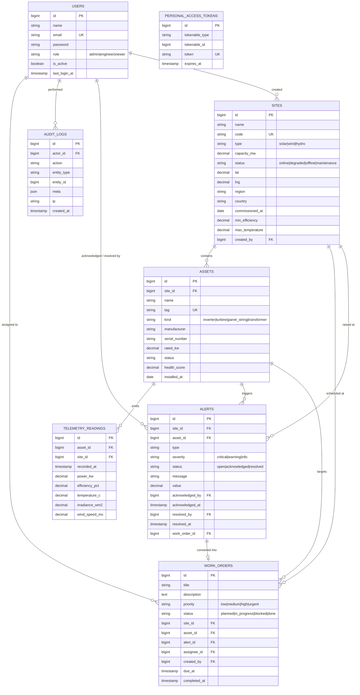

# GridPulse — Database Design

Day 36 · Relational schema · MySQL 8 in production, SQLite for local development and tests · Laravel migrations

## 1. Design approach

The domain is naturally relational: a site owns assets, an asset emits telemetry and triggers alerts,
an alert can become a work order, and every action is attributed to a user. A relational database with
foreign keys gives referential integrity for free, and Eloquent relationships map one-to-one onto it.
Three rules guided the design:

1. Third normal form for every entity table. No repeating groups, no derived columns stored except
   `health_score` (a slow-moving aggregate that is expensive to recompute per request).
2. Enumerations are stored as short strings constrained at the application layer (Form Requests and
   PHP enums), which keeps migrations portable between MySQL and SQLite.
3. Every column used in a `WHERE`, `ORDER BY` or `JOIN` is indexed; telemetry gets a composite
   index on `(asset_id, recorded_at)` and `(site_id, recorded_at)` because every chart query filters by
   one of those pairs and sorts by time.

## 2. Entity relationship diagram

## 3. Tables in detail

### users
| Column | Type | Rules |
| --- | --- | --- |
| id | bigint PK | auto-increment |
| name | varchar(80) | required |
| email | varchar(160) | required, unique |
| password | varchar(255) | bcrypt hash, hidden from JSON |
| role | varchar(16) | `admin` / `engineer` / `viewer`, default `viewer` |
| is_active | boolean | default true; inactive users cannot authenticate |
| last_login_at | timestamp | nullable |
| timestamps | | created_at, updated_at |

Sessions are Sanctum personal access tokens in `personal_access_tokens` (ships with Sanctum).

### sites
| Column | Type | Rules |
| --- | --- | --- |
| name | varchar(120) | required |
| code | varchar(16) | unique, format `SOL-TX-01` |
| type | varchar(8) | solar / wind / hydro |
| capacity_mw | decimal(8,2) | > 0 |
| status | varchar(16) | online / degraded / offline / maintenance |
| lat, lng | decimal(9,6) | −90..90, −180..180 |
| region, country | varchar(80) | required |
| commissioned_at | date | nullable |
| min_efficiency | decimal(5,2) | default 70 — alert threshold |
| max_temperature | decimal(5,2) | default 65 — alert threshold |
| created_by | FK users | null on delete |

Indexes: `code` unique, `(type, status)`.

### assets
Indexes: `site_id`, `tag` unique, `status`. `health_score` (0–100) is updated by the simulator from
recent efficiency. Foreign key `site_id` cascades on delete: an asset cannot outlive its site.

### telemetry_readings
Indexes: `(asset_id, recorded_at)`, `(site_id, recorded_at)`, `recorded_at`.
Append-only. `gridpulse:prune` deletes rows older than seven days. No `updated_at`.

### alerts
Indexes: `(status, severity, created_at)`, `(asset_id, type, status)` — the second one is how the
alert engine checks "is there already an open alert of this type for this asset?" in one indexed lookup.

### work_orders
Indexes: `(status, priority)`, `assignee_id`, `due_at`, `site_id`. `completed_at` is stamped by a
model observer when status changes to `done`.

### audit_logs
Indexes: `created_at`, `actor_id`, `(entity_type, entity_id)`. `meta` is JSON.

## 4. Relationships in Eloquent

| Model | Relationship |
| --- | --- |
| Site | `hasMany(Asset)`, `hasMany(Alert)`, `hasMany(WorkOrder)`, `hasMany(TelemetryReading)`, `belongsTo(User, 'created_by')` |
| Asset | `belongsTo(Site)`, `hasMany(TelemetryReading)`, `hasMany(Alert)`, `hasMany(WorkOrder)` |
| Alert | `belongsTo(Site)`, `belongsTo(Asset)`, `belongsTo(User, 'acknowledged_by')`, `belongsTo(User, 'resolved_by')`, `belongsTo(WorkOrder)` |
| WorkOrder | `belongsTo(Site)`, `belongsTo(Asset)`, `belongsTo(Alert)`, `belongsTo(User, 'assignee_id')`, `belongsTo(User, 'created_by')` |
| User | `hasMany(WorkOrder, 'assignee_id')`, `hasMany(AuditLog, 'actor_id')` |

## 5. Denormalisation decisions (deliberate)

- `telemetry_readings.site_id` duplicates `assets.site_id` so fleet and site aggregations never join
  the hottest table. It is set once at insert and never changes.
- `alerts.message` and `alerts.value` snapshot the condition at the time it was raised, so history
  stays truthful if thresholds are edited later.
- `alerts.work_order_id` and `work_orders.alert_id` point at each other so both screens can render
  the link without a second query. The application keeps them consistent inside a transaction.

## 6. Data volume and retention

40 assets × one reading every 5 s ≈ 690 000 rows per day. The prune command caps the table at seven
days (≈ 4.8 M rows, roughly 500 MB in MySQL with indexes). Daily energy is computed on demand as
average power × elapsed hours per asset per day; a production deployment would roll this into a
`daily_energy` summary table by a nightly job.
